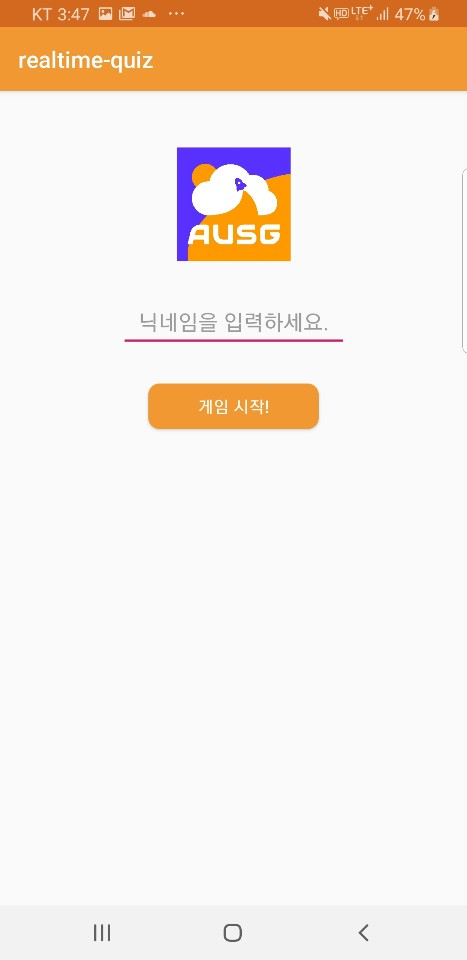
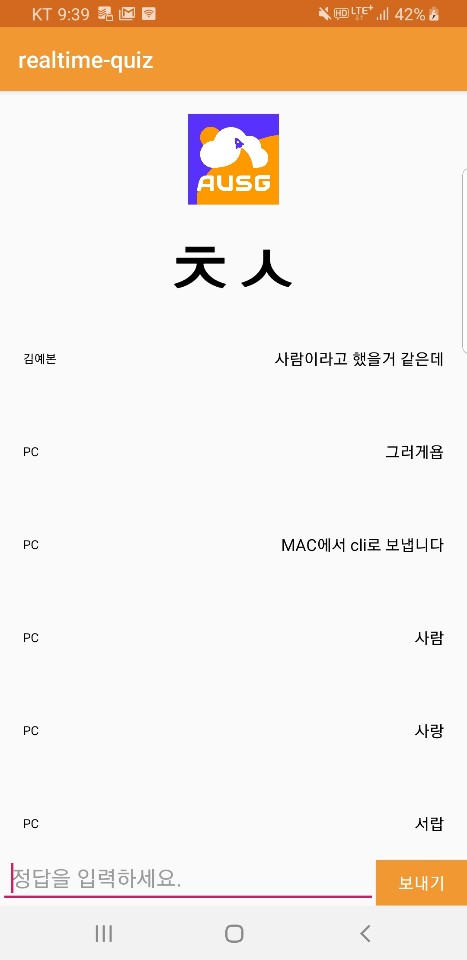

# android-realtime-quiz🥳

#### 본 세션은 AWS 서비스들을 이용하여 아래의 언어로 Websocket 실시간 안드로이드 초성퀴즈 앱을 만들어봅니다.
- 람다 서버 : Node.js
- 안드로이드 클라이언트 : Java

---
### 구현이 완료되면 아래와 같은 어플리케이션을 볼 수 있습니다.

**Username 입력 화면**

  

**초성퀴즈 화면**

  

---

### 해당 세션을 진행하기 위해서는 아래와 같은 것들이 필요합니다.

#### 1. AWS 계정

AWS 서비스를 사용하여 서버를 구축하기 때문에 AWS 계정이 필요합니다.

- AWS 계정 만들기 [이동](https://aws.amazon.com/ko/)

본 세션에서는 아래와 같은 서비스를 이용합니다.
~~~
- AWS IAM
- AWS APIGateway
- AWS Lambda
- AWS DynamoDB
- AWS Cloud Watch
~~~

본 세션의 일환으로 시작하는 모든 리소스는 AWS 계정이 12개월 미만인 경우, 제공하는 AWS 프리티어로 충분히 가능합니다. 프리티어를 넘어서는 경우, 과금 될 수도 있습니다. 따라서, 새로운 실습용 계정을 만드시길 권장합니다. 자세한 내용은 [AWS 프리 티어 페이지](https://aws.amazon.com/free/)를 참조하세요.

---

#### 2. Android Studio

본 세션은 안드로이드 어플리케이션을 통해 클라이언트를 구현하기 때문에 Android Studio 및 Android SDK등이 필요합니다. 

- Android Studio 설치 가이드 [이동](https://github.com/AUSG/ausg-seminar-2019/tree/master/AndroidTrack/preparation)

또한 본 세션에서는 Android SDK 28 Version을 타겟으로 하고있으니 설치에 유의하시기 바랍니다.

---

### 준비가 끝났으니 단계에 따라 천천히 따라와 주세요! 👋

- [AWS IAM 역할(Role) 만들기](https://github.com/yebonkim/android-realtime-quiz/blob/master/guide/AWS_IAM_guide.md)
- [DynamoDB 생성하기](https://github.com/yebonkim/android-realtime-quiz/blob/master/guide/AWS_DynamoDB_guide.md)
- [Websocket 연결 기능 만들기](https://github.com/yebonkim/android-realtime-quiz/blob/master/guide/AWS_websocket_connection_guide.md)
- [Websocket 테스트](https://github.com/yebonkim/android-realtime-quiz/blob/master/guide/AWS_websocket_test_guide.md)
- [Websocket 게임 및 채팅 기능 만들기](https://github.com/yebonkim/android-realtime-quiz/blob/master/guide/AWS_websocket_guide.md)
- [Android 서비스에 연결하기](https://github.com/yebonkim/android-realtime-quiz/blob/master/guide/Android_guide.md)
- [삭제 가이드](https://github.com/yebonkim/android-realtime-quiz/blob/master/guide/delete_guide.md)

