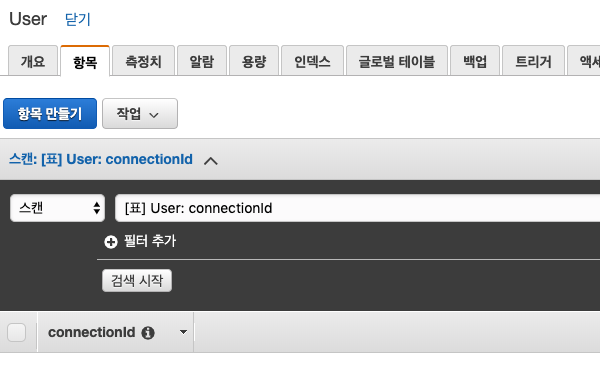
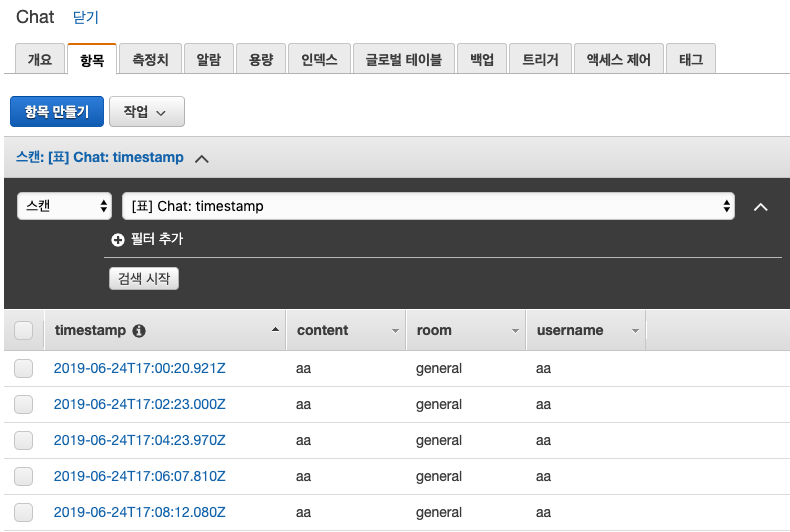
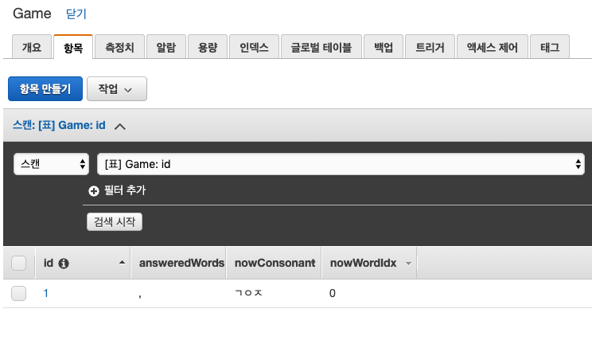
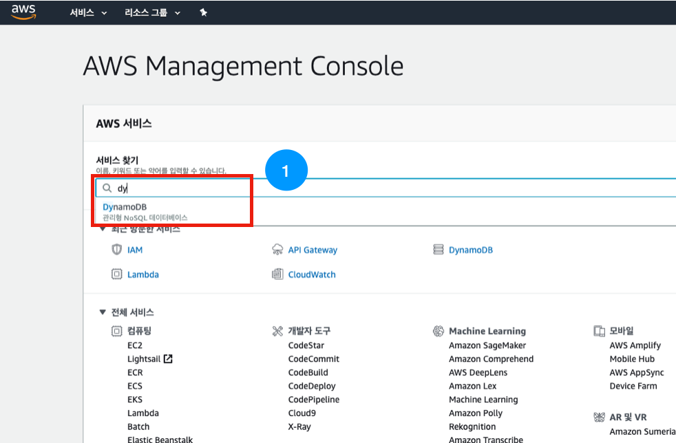
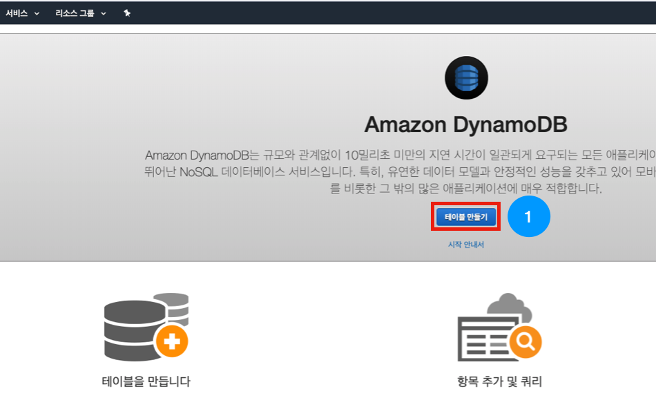
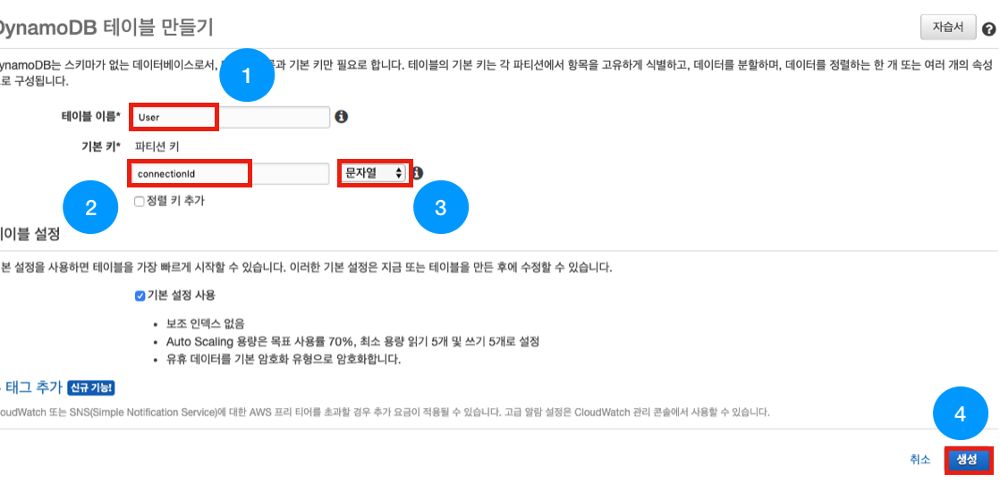
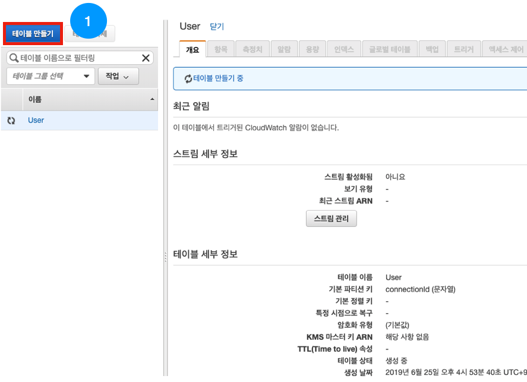
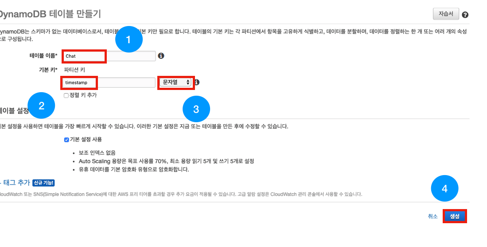
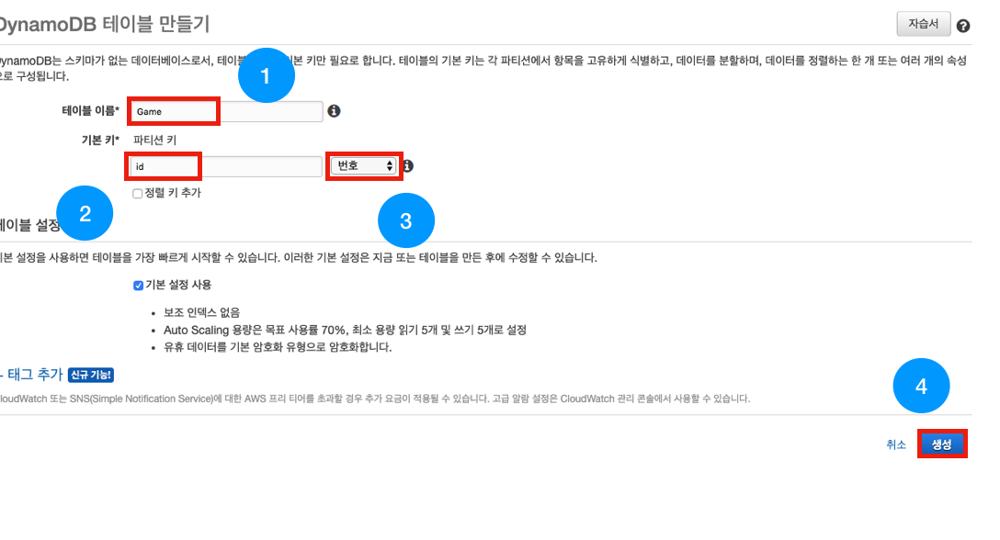
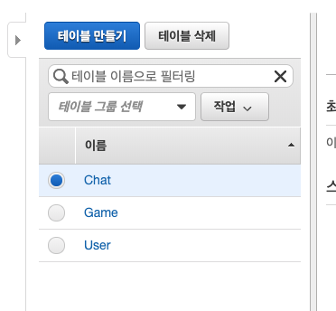

# android-realtime-quiz🥳

## AWS DynamoDB 생성하기

본 세션에서는 아래와 같이 총 3개의 DynamoDB를 사용합니다. 때문에 미리 Table을 만들어 주도록 하겠습니다.

### [User] table
Game과 Chat 데이터 Broadcast를 위해서 Websocket connectionId를 저장합니다.

- Partition Key : connectionId

### [Chat] table
Chat 데이터를 저장하기 위한 테이블입니다.

- partition Key : timestamp

### [Game] table
Game 데이터를 저장하기 위한 테이블입니다. 현재 문제 초성, 현재 문제 index, 이미 나온 정답 등을 저장합니다. 

- partition Key : id

---

### 1. AWS DynamoDB 접속

아래와 같이 AWS console에 접속하여 'dy'를 검색 후 DynamoDB 서비스로 접속합니다.
 

### 2. Table 생성

아래와 같은 화면이 뜨면 [테이블 만들기]를 눌러줍니다.

---

**[User] Table**을 먼저 생성해 보겠습니다.

#### 지금부터의 작업은 대소문자를 구분하므로 대소문자에 유의해주세요!

아래와 같이

- [테이블 이름] - [User]
- [파티션 키] - [connectionId]
- [파티션 키 자료형] - [문자열]

을 입력한 뒤에 [생성] 버튼을 눌러주세요.

---

아래와 같이 [User] 테이블이 생성 중입니다. 나머지 테이블들을 만들어 주기 위해 [테이블 만들기] 버튼을 눌러주세요.

---

**[Chat] Table**을 생성해 보겠습니다.

- [테이블 이름] - [Chat]
- [파티션 키] - [timestamp]
- [파티션 키 자료형] - [문자열]

를 입력한 뒤에 [생성] 버튼을 눌러주세요.

---

똑같은 방법으로 **[Game] Table**을 생성해 보겠습니다.

- [테이블 이름] - [Game]
- [파티션 키] - [id]
- [파티션 키 자료형] - [번호]

를 입력한 뒤에 [생성] 버튼을 눌러주세요.

---

아래와 같이 3개의 Table이 보인다면 DynamoDB 생성이 모두 끝났습니다!

### DynamoDB 생성하기가 모두 끝났습니다.
#### Websocket 연결 기능 만들기를 진행해주세요.😀

- [AWS IAM 역할(Role) 만들기](https://github.com/yebonkim/android-realtime-quiz/blob/master/guide/AWS_IAM_guide.md)
- [DynamoDB 생성하기](https://github.com/yebonkim/android-realtime-quiz/blob/master/guide/AWS_DynamoDB_guide.md)
- [Websocket 연결 기능 만들기](https://github.com/yebonkim/android-realtime-quiz/blob/master/guide/AWS_websocket_connection_guide.md)
- [Websocket 테스트](https://github.com/yebonkim/android-realtime-quiz/blob/master/guide/AWS_websocket_test_guide.md)
- [Websocket 게임 및 채팅 기능 만들기](https://github.com/yebonkim/android-realtime-quiz/blob/master/guide/AWS_websocket_guide.md)
- [Android 서비스에 연결하기](https://github.com/yebonkim/android-realtime-quiz/blob/master/guide/Android_guide.md)