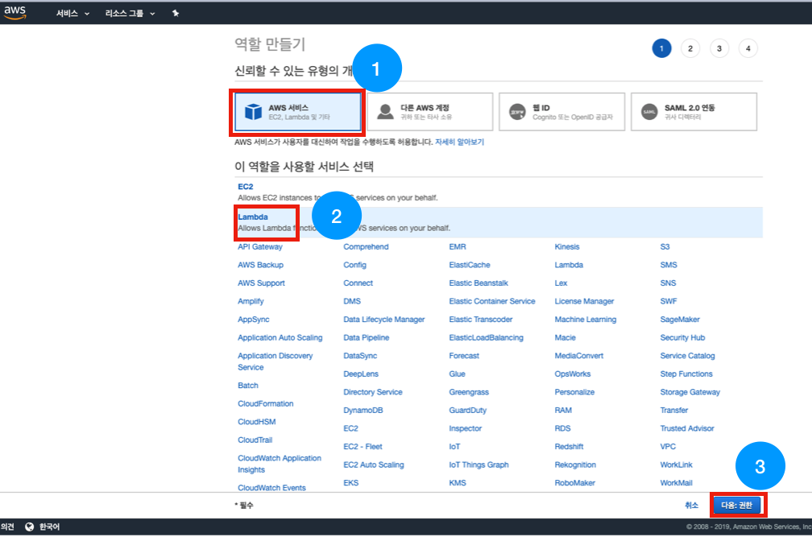

# android-realtime-quiz🥳

## AWS IAM 역할(Role) 만들기

본 세션에서는 아래와 같은 서비스를 이용하기 때문에 해당 권한을 가진 역할(Role)을 만들어 주어야 합니다.
~~~
- AWS IAM
- AWS APIGateway
- AWS Lambda
- AWS DynamoDB
~~~

---

### 1. AWS IAM 접속

아래와 같이 AWS console에 접속하여 'iam'을 검색 후 IAM 서비스로 접속합니다.

### 2. Policy 생성

필요한 권한에 대한 Policy를 먼저 생성해 주겠습니다!

아래 사진과 같이 좌측 메뉴에서 [정책]을 선택하여 아래 화면으로 들어와 주세요.

[정책 생성]을 눌러주세요.

---

아래와 같이 [JSON] 탭을 눌러주세요.

후에 아래의 텍스트를 그대로 복사 붙여넣기 한 후, [정책 검토] 버튼을 눌러주세요.

~~~
{
    "Version": "2012-10-17",
    "Statement": [
        {
            "Sid": "VisualEditor0",
            "Effect": "Allow",
            "Action": [
                "apigateway:*",
                "logs:*",
                "lambda:*",
                "dynamodb:*"
            ],
            "Resource": "*"
        },
        {
            "Sid": "VisualEditor1",
            "Effect": "Allow",
            "Action": "execute-api:ManageConnections",
            "Resource": "arn:aws:execute-api:*:*:**/@connections/*"
        }
    ]
}
~~~

### 주의! 1

~~~
해당 세션에서는 세션의 용이함을 위해 사용할 서비스의 모든 권한을 열어주고 있습니다. 
실제 서비스에서는 적절히 권한을 다시 설정해주세요!
~~~

### 주의! 2
~~~
해당 세션에서는 서비스에 직접적으로 연관된 권한이 아닌 [execute-api:ManageConnections] 정책을 사용하고 있습니다.
이 정책을 깜박하시면 WebSocket이 정상적으로 작동하지 않으니 유의해주세요!
~~~

---

아래와 같이 이름에 [android-realtime-policy]를 입력하신 후 하단 표시의 [정책 생성] 버튼을 눌러주세요.

### 3. 역할(Role) 생성

생성한 정책(Policy)이 연결된 역할(Role)을 만들어 보겠습니다.

다시 좌측 메뉴에서 1번 표시 [역할]을 눌러 역할 화면으로 들어오신 뒤 2번 표시인 [역할 만들기]를 눌러주세요.

---

아래와 같이 [AWS 서비스]에서 [Lambda]를 선택해 주신 뒤 [다음:권한]을 선택해주세요.

---

아래와 같이 정책 필터에 [android]를 입력해 준 뒤, 이전에 만들어 두었던 [android-realtime-policy]를 선택해주세요.

또 정책 필터에 [cloud]를 입력해 준 뒤, [AmazonAPIGatewayPushToCloudWatchLogs]를 선택해주세요.

후에 [다음:태그] 버튼을 클릭해주세요.

---

태그 추가는 선택사항이니 바로 [다음:검토]를 눌러주세요.

---

아래와 같이 역할 이름에 [android-realtime-role]라고 적은 후 [역할 만들기] 버튼을 눌러주세요.

### AWS IAM 역할(Role) 만들기 과정이 끝났습니다!
#### DynamoDB 생성하기를 진행해주세요.😀

- [AWS IAM 역할(Role) 만들기](https://github.com/yebonkim/android-realtime-quiz/blob/master/guide/AWS_IAM_guide.md)
- [DynamoDB 생성하기](https://github.com/yebonkim/android-realtime-quiz/blob/master/guide/AWS_DynamoDB_guide.md)
- [Websocket 연결 기능 만들기](https://github.com/yebonkim/android-realtime-quiz/blob/master/guide/AWS_websocket_connection_guide.md)
- [Websocket 게임 및 채팅 기능 만들기](https://github.com/yebonkim/android-realtime-quiz/blob/master/guide/AWS_websocket_guide.md)
- [Android 서비스에 연결하기](https://github.com/yebonkim/android-realtime-quiz/blob/master/guide/Android_guide.md)