# android-realtime-quiz🥳

## Websock연결 기능 만들기

이번 파트에서는 Websocket의 connection을 관리하는 lambda함수를 올리고 API Gateway에 연결시켜보도록 하겠습니다.

#### AWS는 2018년 API Gateway와 Lambda를 이용하여 Websocket을 사용할 수 있다는 것을 발표했습니다.🔥🔥🔥
#### [세션 링크](https://www.youtube.com/watch?v=3SCdzzD0PdQ)에서 자세한 내용을 확인할 수 있습니다.

### 1. AWS API Gateway 접속

아래와 같이 AWS console에 접속하여 'api'를 검색 후 API Gateway 서비스로 접속합니다.
 

### 2. API Gateway 생성

아래와 같은 화면이 뜨면 [시작]을 눌러줍니다.

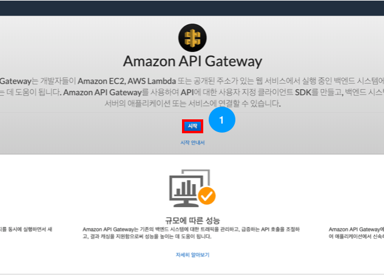

---

아래와 같이 API를 [WebSocket]을 선택해줍니다.

API 이름을 [android-realtime-api] 로 입력한 뒤,

경로 선택 표현식에는 [$request.body.message] 을 입력한 뒤

[API 생성] 버튼을 눌러줍니다.

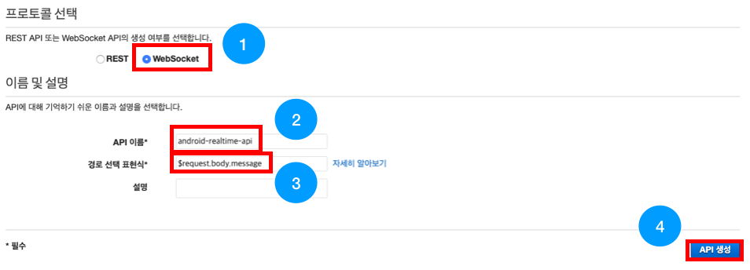

### 3. Connection 관리 Lambda 생성

아래와 같이 AWS 콘솔에서 [la] 를 검색하여 Lambda 서비스로 들어갑니다.

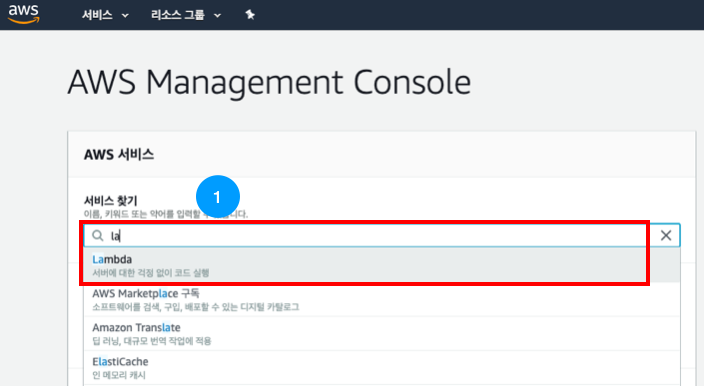

아래와 같이 [함수 생성] 버튼을 눌러줍니다.

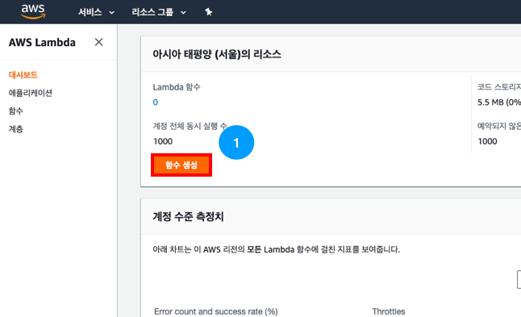

---

이제부터 본격적으로 람다 함수를 생성해봅니다!

첫 화면에서 아래와 같이 [새로 작성]을 선택해주세요.

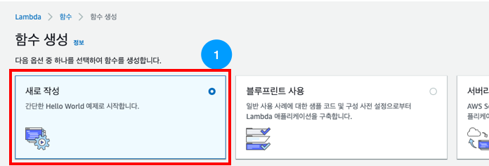

아래와 같이 함수 이름에 [android-realtime-lambda]를 입력해주세요.

런타임은 [Node.js 10.x]를 선택해주세요.

권한 부분에서 [▼실행 역할 선택 또는 생성]을 선택하여 IAM 파트에서 만들었던 역할(Role)을 연결할 수 있도록 해주세요.

실행 역할에서 [기존 역할 선택] 을 선택해주세요.

기존 역할에서 [android-realtime-role]을 선택해주세요.

하단의 [함수 생성] 버튼을 눌러주세요.

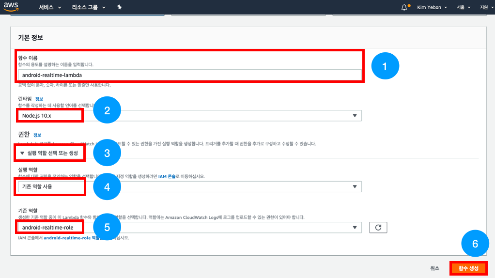

---

아래와 같은 화면이 나오면 성공적으로 역할(Role)이 연결된 것입니다!

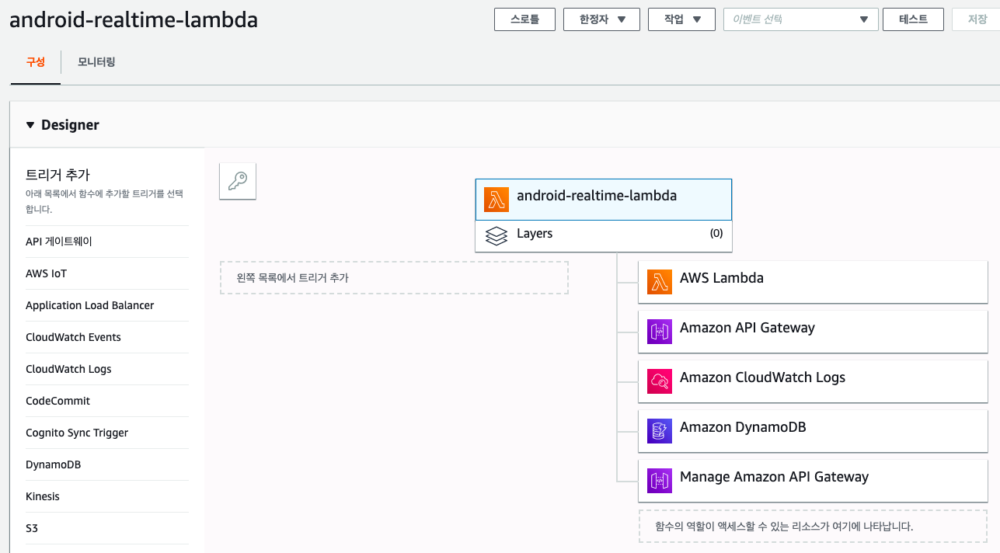

---

스크롤을 내리면 나오는 함수 코드 파트에 아래 소스를 그대로 복사 붙여넣기 해주세요.

아래 그림과 같이 소스를 복사 붙여넣기 한 후 [저장] 버튼이 활성화 되었다면 [저장] 버튼을 눌러주세요.

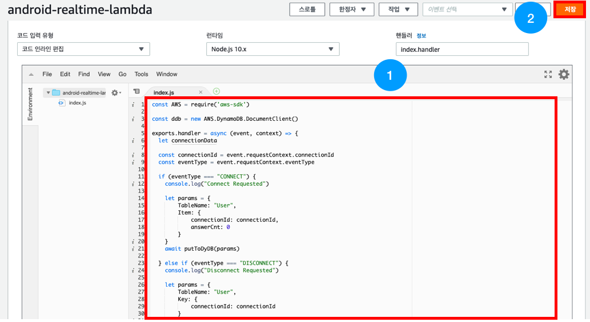

~~~
const AWS = require('aws-sdk')

const ddb = new AWS.DynamoDB.DocumentClient()

exports.handler = async (event, context) => {
  let connectionData
  
  const connectionId = event.requestContext.connectionId
  const eventType = event.requestContext.eventType

  if (eventType === "CONNECT") {
    console.log("Connect Requested")

    let params = {
        TableName: "User",
        Item: {
            connectionId: connectionId,
            answerCnt: 0
        }
    }
    await putToDyDB(params)

  } else if (eventType === "DISCONNECT") {
    console.log("Disconnect Requested")

    let params = {
        TableName: "User",
        Key: {
            connectionId: connectionId
        }
    }
    
    await deleteFromDyDB(params)
  } else {
    return { statusCode: 404, body: "illegal access" }
  }

  return { statusCode: 200, body: 'Data sent.' }
}

async function putToDyDB(params) {
    await ddb.put(params, function(err, data) {
      if (err) {
          console.error("Unable to add item to '" + params.TableName + "' Table. Error JSON:", JSON.stringify(err, null, 2))
      } else {
          console.log("Added item to '" + params.TableName + "' Table:", JSON.stringify(data, null, 2))
      }
    }).promise()
}

async function deleteFromDyDB(params) {
    await ddb.delete(params, function(err, data) {
      if (err) {
          console.error("Unable to delete item from '" + params.TableName + "' Table. Error JSON:", JSON.stringify(err, null, 2))
      } else {
          console.log("Deleted item from '" + params.TableName + "' Table:", JSON.stringify(data, null, 2))
      }
    }).promise()
}
~~~

---

스크롤을 조금 더 내려 제한시간을 [30]초를 입력해주세요.

[저장] 버튼을 다시 눌러주세요.

---

### 4. API Gateway에 Lambda 연결

이제 만들어 두었던 API Gateway와 Lambda를 연결해 줄 차례입니다!

아래와 같이 AWS console에 접속하여 'api'를 검색 후 API Gateway 서비스로 접속합니다.
 

---

[android-realtime-api] 를 선택해주세요.

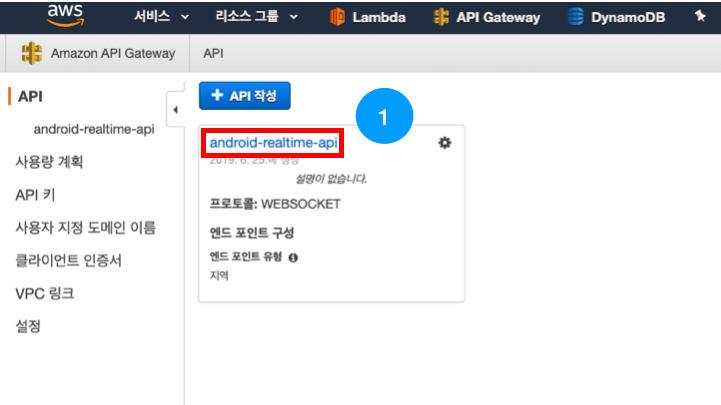

---

[$connect] 를 선택해서 설정화면으로 들어와 주세요.

통합 유형은 [Lambda 함수]를 선택해주세요.

Lambda 리전은 [ap-northeast-2]를 선택해주세요.

Lambda 함수에서 [android-realtime-lambda]를 입력, 선택해주세요.

하단의 [저장] 버튼을 눌러주세요.

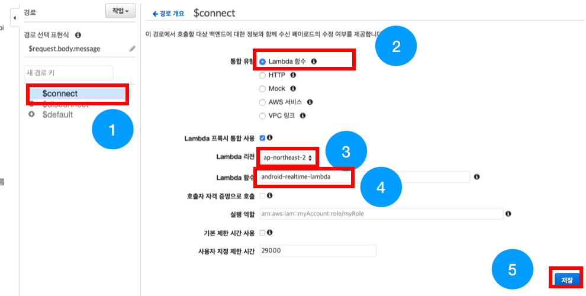

다음 대화상자에서도 [확인] 버튼을 눌러주세요.

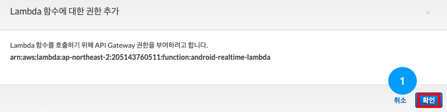

---

마찬가지로 disconnect 도 연결해주겠습니다.

[$disconnect] 를 선택해서 설정화면으로 들어와 주세요.

통합 유형은 [Lambda 함수]를 선택해주세요.

Lambda 리전은 [ap-northeast-2]를 선택해주세요.

Lambda 함수에서 [android-realtime-lambda]를 입력, 선택해주세요.

하단의 [저장] 버튼을 눌러주세요.

다음 대화상자에서도 [확인] 버튼을 눌러주세요.

---

API Gateway와 Lambda의 연결이 끝났습니다!

[작업]버튼을 눌러 [API 배포]를 선택해주세요.

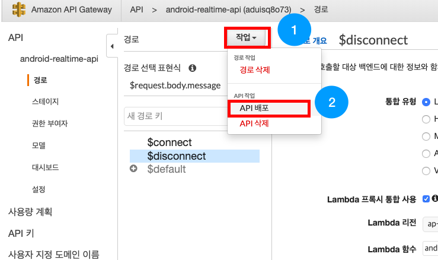

---

아래와 같이 배포 스테이지에서 [[새 스테이지]]를 선택해주세요.

스테이지 이름에 [dev]를 입력해주세요.

[배포] 버튼이 활성화되면 눌러주세요.

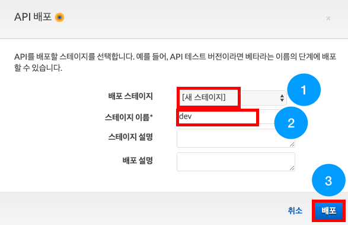

배포가 완료되어 엔드포인트가 생성되었습니다! 이제 웹소켓을 테스트 해볼 수 있습니다!

### Websock연결 기능 만들기가 끝났습니다!
#### Websocket 게임 및 채팅 기능 만들기를 진행해주세요.😀

- [AWS IAM 역할(Role) 만들기](https://github.com/yebonkim/android-realtime-quiz/blob/master/guide/AWS_IAM_guide.md)
- [DynamoDB 생성하기](https://github.com/yebonkim/android-realtime-quiz/blob/master/guide/AWS_DynamoDB_guide.md)
- [Websocket 연결 기능 만들기](https://github.com/yebonkim/android-realtime-quiz/blob/master/guide/AWS_websocket_connection_guide.md)
- [Websocket 게임 및 채팅 기능 만들기](https://github.com/yebonkim/android-realtime-quiz/blob/master/guide/AWS_websocket_guide.md)
- [Android 서비스에 연결하기](https://github.com/yebonkim/android-realtime-quiz/blob/master/guide/Android_guide.md)