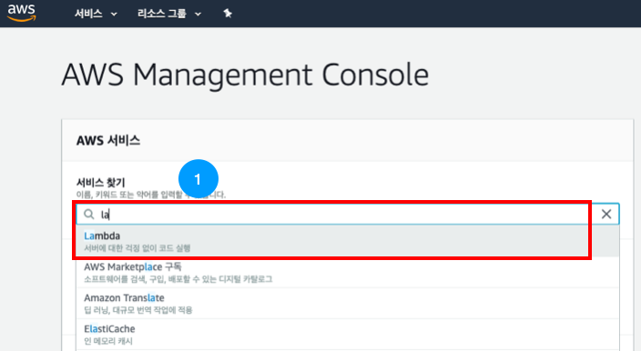
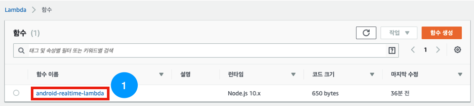
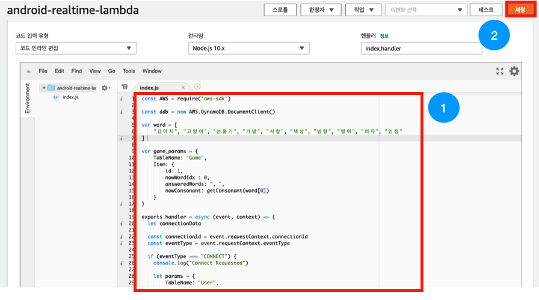
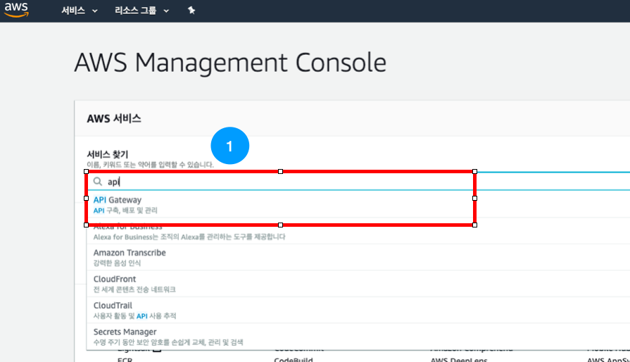
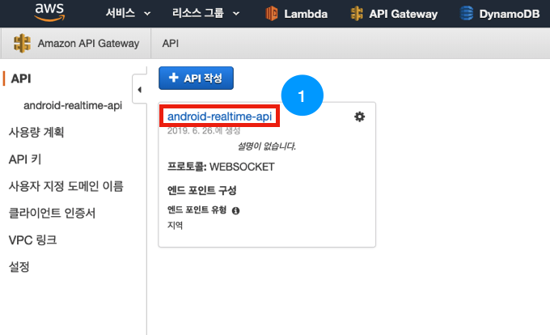
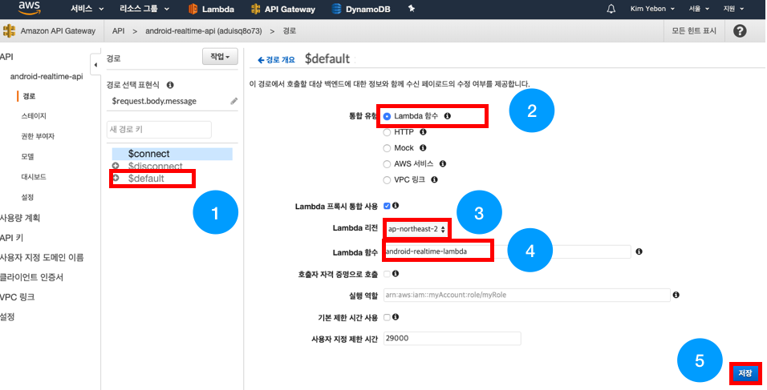
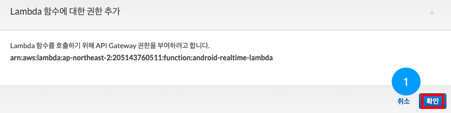
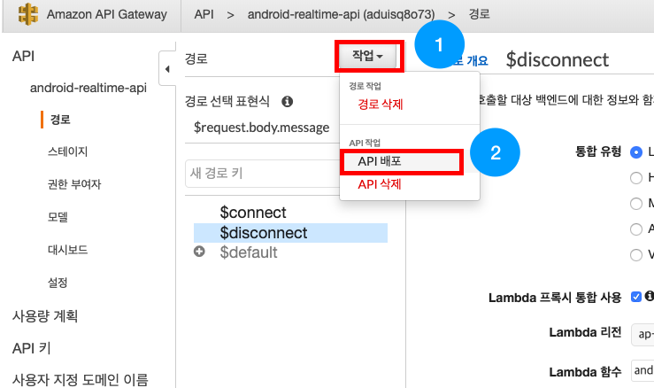
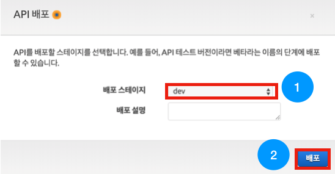

# android-realtime-quiz🥳

## Websocket 게임 및 채팅 기능 만들기

이번 파트에서는 Websocket의 connection을 관리하는 lambda함수에 게임 및 채팅 기능을 추가해보겠습니다.

#### AWS는 2018년 API Gateway와 Lambda를 이용하여 Websocket을 사용할 수 있다는 것을 발표했습니다.🔥🔥🔥
#### [세션 링크](https://www.youtube.com/watch?v=3SCdzzD0PdQ)에서 자세한 내용을 확인할 수 있습니다.

### 1. AWS Lambda 수정

아래와 같이 AWS console에 접속하여 [la]를 검색 후 Lambda 서비스로 접속합니다.
 

---

아래 화면에서 [android-realtime-lambda] 함수를 선택해줍니다.

---

아래와 같이 함수 코드부분을 아래 소스로 전체 복사 & 붙여넣기 해주세요.

후에 [저장] 버튼을 눌러주세요.

~~~
const AWS = require('aws-sdk')

const ddb = new AWS.DynamoDB.DocumentClient()

var word = [
    "강아지", "고양이", "선풍기", "가방", "서랍", "책상", "방향", "영어", "의자", "사진"
]

var game_params = {
    TableName: "Game",
    Item: {
        id: 1,
        nowWordIdx : 0,
        answeredWords: ", ",
        nowConsonant: getConsonant(word[0])
    }
}

exports.handler = async (event, context) => {
  let connectionData
  
  const connectionId = event.requestContext.connectionId
  const eventType = event.requestContext.eventType

  if (eventType === "CONNECT") {
    console.log("Connect Requested")

    let params = {
        TableName: "User",
        Item: {
            connectionId: connectionId,
            answerCnt: 0
        }
    }
    await putToDyDB(params)

    if(await isOne()) {
      game_params.Item.nowWordIdx = 0
      game_params.Item.nowConsonant = getConsonant(word[0])
      game_params.Item.answeredWords = ", "
      await putToDyDB(game_params)
    }
  } else if (eventType === "DISCONNECT") {
    console.log("Disconnect Requested")

    let params = {
        TableName: "User",
        Key: {
            connectionId: connectionId
        }
    }
    
    await deleteFromDyDB(params)
  } else if (eventType === "MESSAGE") {
      let isJson = true
      var payload
      var keys
      try {
        payload = JSON.parse(event.body)
        keys = Object.keys(payload)
      }catch(e) {
          isJson = false
      }
      
     if(isJson === true && keys.includes("content") && keys.includes("username")) {
        let params = {
            TableName: "Chat",
            Item: {
                "room": "general",
                "content": payload.content,
                "timestamp": new Date().toISOString(),
                "username": payload.username
            }
        }
        await putToDyDB(params)
        await getGameData().then(async (result) => {
            if(isAnswer(payload.content)) {
                await addScore(connectionId)
                await updateGameData(payload.content)
            }
            await broadcastMsg(event, payload)
        })
    }
    
    await broadcastGameData(event)
  } else {
    return { statusCode: 404, body: "illegal access" }
  }

  return { statusCode: 200, body: 'Data sent.' }
}

async function putToDyDB(params) {
    await ddb.put(params, function(err, data) {
      if (err) {
          console.error("Unable to add item to '" + params.TableName + "' Table. Error JSON:", JSON.stringify(err, null, 2))
      } else {
          console.log("Added item to '" + params.TableName + "' Table:", JSON.stringify(data, null, 2))
      }
    }).promise()
}

async function deleteFromDyDB(params) {
    await ddb.delete(params, function(err, data) {
      if (err) {
          console.error("Unable to delete item from '" + params.TableName + "' Table. Error JSON:", JSON.stringify(err, null, 2))
      } else {
          console.log("Deleted item from '" + params.TableName + "' Table:", JSON.stringify(data, null, 2))
      }
    }).promise()
}

async function getFromDyDB(params) {
    let result = null
    await ddb.get(params, function(err, data) {
      if (err) {
          console.error("Unable to get item from '" + params.TableName + "' Table. Error JSON:", JSON.stringify(err, null, 2))
      } else {
          console.log("Got item from '" + params.TableName + "' Table:", JSON.stringify(data, null, 2))
          result = data
      }
    }).promise()
    return result
}

async function getGameData() {
    var params = {
        TableName: "Game",
        Key: {
            id: 1
        }
    }

    await getFromDyDB(params).then((result) => {
        game_params.Item.nowWordIdx = result.Item.nowWordIdx
        game_params.Item.answeredWords = result.Item.answeredWords
    })
}

async function isOne() {
    try {
      connectionData = await ddb.scan({ TableName: "User", ProjectionExpression: 'connectionId' }).promise()
    } catch (e) {
      return { statusCode: 500, body: e.stack }
    }

    if(connectionData.Count == 1) {
        return true
    } else {
        return false
    }
}

async function addScore(connectionId) {
    let params = {
      TableName: "User",
      Key: {
          connectionId: connectionId
      }
    }

    await getFromDyDB(params).then(async (result) => {
      const newAnswerCnt = result.Item.answerCnt + 1
      let params = {
        TableName: "User",
        Item: {
            connectionId: connectionId,
            answerCnt: newAnswerCnt
        }
      }
      await putToDyDB(params)
    })
}

function isAnswer(content) {
    if(game_params.Item.answeredWords.includes(content) == true) {
        console.log("first false")
        return false
    }
    if(word[game_params.Item.nowWordIdx] !== content) {
        console.log(game_params.Item.nowWordIdx)
        console.log(word[game_params.Item.nowWordIdx])
        return false
    }
    console.log("first false3")
    return true
}

async function updateGameData(content) {
    console.log(game_params)
    game_params.Item.answeredWords += (", " + content)
    game_params.Item.nowWordIdx++
    game_params.Item.nowWordIdx %= word.length
    game_params.Item.nowConsonant = getConsonant(word[game_params.Item.nowWordIdx])

    if(game_params.Item.nowWordIdx == 0) {
        game_params.Item.answeredWords = ""
    }

    await putToDyDB(game_params)
}

async function broadcastGameData(event) {
    try {
      connectionData = await ddb.scan({ TableName: "User", ProjectionExpression: 'connectionId' }).promise()
    } catch (e) {
      return { statusCode: 500, body: e.stack }
    }
    
    const apigwManagementApi = new AWS.ApiGatewayManagementApi({
      endpoint: event.requestContext.domainName + '/' + event.requestContext.stage
    })
    
    const postCalls = connectionData.Items.map(async ({ connectionId }) => {
        try {
            await apigwManagementApi.postToConnection({ ConnectionId: connectionId, Data: JSON.stringify(game_params.Item) }).promise()
        } catch (e) {
            return { statusCode: 500, body: e.stack }
        }
    })

    try {
        await Promise.all(postCalls)
    } catch (e) {
        return { statusCode: 500, body: e.stack }
    }
}

async function broadcastMsg(event, payload) {
    try {
      connectionData = await ddb.scan({ TableName: "User", ProjectionExpression: 'connectionId' }).promise()
    } catch (e) {
      return { statusCode: 500, body: e.stack }
    }
    
    const apigwManagementApi = new AWS.ApiGatewayManagementApi({
      endpoint: event.requestContext.domainName + '/' + event.requestContext.stage
    })
    
    const postCalls = connectionData.Items.map(async ({ connectionId }) => {
        try {
            await apigwManagementApi.postToConnection({ ConnectionId: connectionId, Data: JSON.stringify(payload) }).promise()
        } catch (e) {
            return { statusCode: 500, body: e.stack }
        }
    })

    try {
        await Promise.all(postCalls)
    } catch (e) {
        return { statusCode: 500, body: e.stack }
    }
}

function getConsonant(str) {
  let consonant = ["ㄱ","ㄲ","ㄴ","ㄷ","ㄸ","ㄹ","ㅁ","ㅂ","ㅃ","ㅅ","ㅆ","ㅇ","ㅈ","ㅉ","ㅊ","ㅋ","ㅌ","ㅍ","ㅎ"]
  let result = ""
  for(let i = 0 ; i < str.length ; i++) {
    let code = str.charCodeAt(i) - 44032
    if(code > -1 && code < 11172) {
        result += consonant[Math.floor(code/588)]
    }
  }
  return result
}
~~~

### 2. AWS API Gateway 접속

Connect, Disconnect외에도 데이터를 받을 수 있도록 람다함수를 API Gateway에 연결해봅시다!

아래와 같이 AWS console에 접속하여 'api'를 검색 후 API Gateway 서비스로 접속합니다.
 

### 3. API Gateway 연결

아래와 같은 화면이 뜨면 [android-realtime-api]를 선택해줍니다.

---

아래와 같이 [$default] 를 선택해서 설정화면으로 들어와 주세요.

통합 유형은 [Lambda 함수]를 선택해주세요.

Lambda 리전은 [ap-northeast-2]를 선택해주세요.

Lambda 함수에서 [android-realtime-lambda]를 입력, 선택해주세요.

하단의 [저장] 버튼을 눌러주세요.

다음 대화상자에서도 [확인] 버튼을 눌러주세요.

---

API Gateway와 Lambda의 연결이 끝났습니다!

[작업]버튼을 눌러 [API 배포]를 선택해주세요.

이전 Websocket Connecton에서 배포해주었지만 $default를 새로 연결하였으니 한 번더 배포해주셔야 합니다!

---

아래와 같이 배포 스테이지에서 [dev]를 선택해주세요.

[배포] 버튼이 활성화되면 눌러주세요.

배포가 완료되어 엔드포인트가 생성되었습니다! 이제 웹소켓을 테스트 해볼 수 있습니다!

### Websocket 게임 및 채팅 기능 만들기가 끝났습니다!
#### Android 서비스에 연결하기를 진행해주세요.😀

- [AWS IAM 역할(Role) 만들기](https://github.com/yebonkim/android-realtime-quiz/blob/master/guide/AWS_IAM_guide.md)
- [DynamoDB 생성하기](https://github.com/yebonkim/android-realtime-quiz/blob/master/guide/AWS_DynamoDB_guide.md)
- [Websocket 연결 기능 만들기](https://github.com/yebonkim/android-realtime-quiz/blob/master/guide/AWS_websocket_connection_guide.md)
- [Websocket 게임 및 채팅 기능 만들기](https://github.com/yebonkim/android-realtime-quiz/blob/master/guide/AWS_websocket_guide.md)
- [Android 서비스에 연결하기](https://github.com/yebonkim/android-realtime-quiz/blob/master/guide/Android_guide.md)