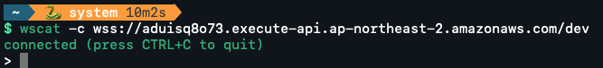
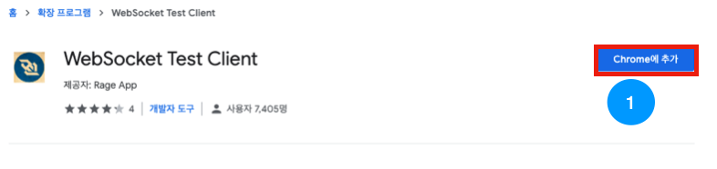
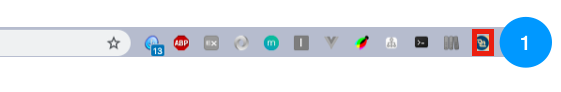
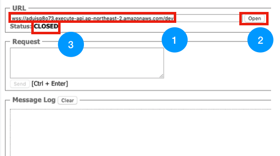
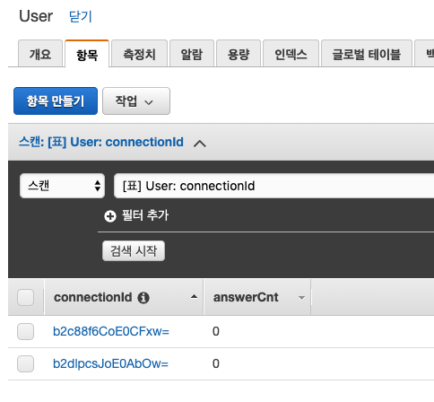

# android-realtime-quiz🥳

## Websocket 테스트

이번 파트에서는 이전 파트에서 개발한 Websocket을 테스트해보도록 하겠습니다.

### npm이 설치된 분들은 1번 과정을 진행해주세요.
### npm이 설치되지 않았거나 CLI보다 GUI가 좋으신 분들은 3번 과정을 진행해주세요.

#### 진행이전에 자신의 Websocket 엔드포인트 주소를 확인해주세요.

#### 참고 (WSS Endpoint 보는 방법)

AWS APIGateway 서비스에 들어가 [android-realtime-api]를 선택한 후 

아래 그림과 같이 [스테이지], [dev]를 차례로 클릭하면 엔드포인트를 확인할 수 있습니다.

wss로 시작하는 엔드포인트를 소스에 넣어주세요!

### 1. wscat 설치(CLI)

아래명령어를 통해 wscat을 설치해주세요.
~~~
$npm install -g wscat
~~~

설치가 안되시는 분들은 당황하지 않고 3번 과정부터 진행하시면 됩니다.🤗

### 2. WebSocket 연결(CLI)

아래 명령어를 통해 배포해 둔 WebSocket에 접속할 수 있습니다.

~~~
$wscat -c wss://자신의 Websocket endpoint 주소
~~~

아래와 같이 [connected]가 표시된다면 접속이 완료된 것입니다! 5번 과정으로 이동하여 DynamoDB에도 데이터가 잘 들어왔는지 확인해주세요.

### 3. Chrome plugin 설치

다음 [주소](
https://chrome.google.com/webstore/detail/websocket-test-client/fgponpodhbmadfljofbimhhlengambbn)에 접속하여 아래와 같은 화면이 나오면 [Chrome에 추가]를 눌러줍니다.

---

아래와 같이 크롬에 플러그인이 추가되었다면 플러그인을 클릭해줍니다.

URL 부분에 wss로 시작하는 자신의 Websocket 엔드포인트 주소를 넣은 후 [Open] 버튼을 클릭해줍니다.

status가 [Opened]로 바뀌면 접속이 완료된 것입니다! 4번 과정으로 이동하여 DynamoDB에도 데이터가 잘 들어왔는지 확인해주세요.

### 4. DynamoDB 확인

Websocket연결이 완료되었다면 람다 함수 코드에 의하여 Disconnect가 되기 전까지 DynamoDB테이블의 [User] 테이블에 connectionId가 존재하게 됩니다.

아래 그림과 같이 DynamoDB에 접속하여 [User] 테이블을 선택한 뒤 [항목] 탭을 클릭해주세요.

위 그림과 같이 현재 Open한 Connection만큼 데이터가 존재한다면 이전까지의 과정이 무사히 완료되었다는 것을 알 수 있습니다.

### Websock 테스트가 끝났습니다!
#### Websocket 게임 및 채팅 기능 만들기를 진행해주세요.😀

- [AWS IAM 역할(Role) 만들기](https://github.com/yebonkim/android-realtime-quiz/blob/master/guide/AWS_IAM_guide.md)
- [DynamoDB 생성하기](https://github.com/yebonkim/android-realtime-quiz/blob/master/guide/AWS_DynamoDB_guide.md)
- [Websocket 연결 기능 만들기](https://github.com/yebonkim/android-realtime-quiz/blob/master/guide/AWS_websocket_connection_guide.md)
- [Websocket 테스트](https://github.com/yebonkim/android-realtime-quiz/blob/master/guide/AWS_websocket_test_guide.md)
- [Websocket 게임 및 채팅 기능 만들기](https://github.com/yebonkim/android-realtime-quiz/blob/master/guide/AWS_websocket_guide.md)
- [Android 서비스에 연결하기](https://github.com/yebonkim/android-realtime-quiz/blob/master/guide/Android_guide.md)