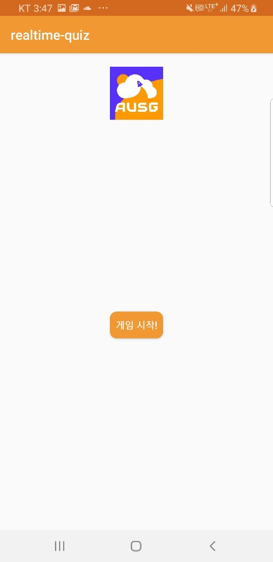
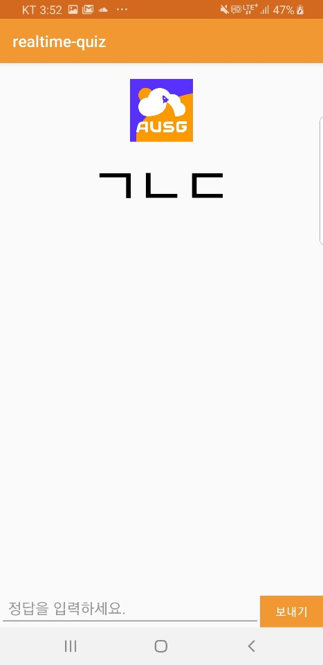
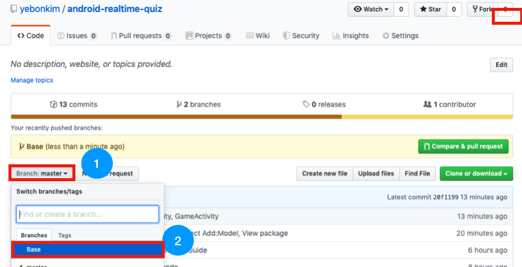
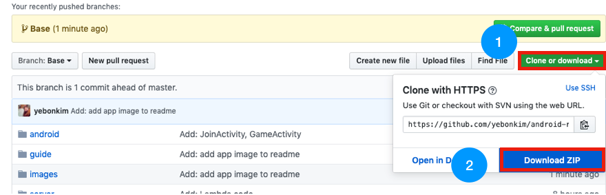
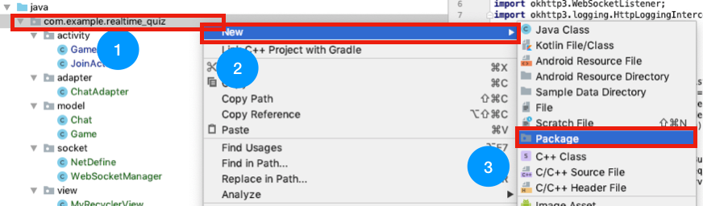
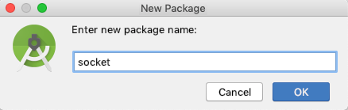
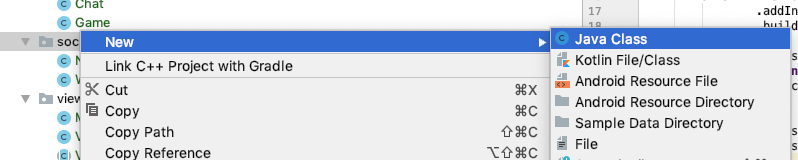
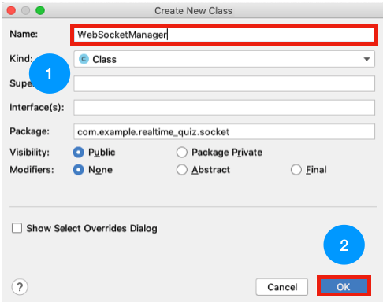
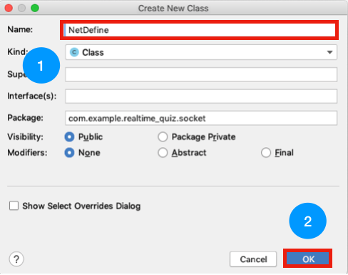

# android-realtime-quiz🥳

## Android 서비스에 연결하기

이번 파트에서는 AWS로 개발한 채팅 서버에 Android를 연결해보도록 하겠습니다.

### 핸즈온 시간을 고려하여 대부분의 기능이 구현되어 있는 Base 프로젝트를 만들어 두었습니다.
### 핸즈온은 이 Base 프로젝트를 수정해 나가는 형식으로 진행됩니다.

#### Base Project에 구현되었거나 변경된 파일들입니다. 필요하실 때 천천히 살펴봐 주세요!

- [app - build.gralde] - ButterKnife, OkHttp등 라이브러리 추가
- [AndroidManifest.xml] - 인터넷 퍼미션 추가, GameActivity 컴포넌트 추가
- [JoinActivity.java, activity_join.xml] - username 입력 Activity 추가

- [GameActivity.java, activity_game.xml] - start 버튼을 클릭하면 게임시작

**[start 버튼 누르기 전]**

**[start 버튼 누른 후]**
- [model package] - DynamoDB와 맞는 Chat, Game 모델 추가
- [view package] - RecyclerView 구현을 위한 class 추가
- [adapter package] - RecyclerView 구현을 위한 ChatAdapter 추가
- [drawable] - AUSG Logo, 오렌지 버튼, 오렌지 Radius Background 추가
- [colors.xml] - 색상 추가
- [strings.xml] - string 추가

### 1. Base Project Clone

cli에 git이 설치되신 분들은

~~~
$git clone https://github.com/yebonkim/android-realtime-quiz.git
$git checkout Base
~~~

를 입력해주세요.

git이 설치되지 않은 분들은 아래 그림과 같이 직접 [Branch:master▼]를 눌러 [Base]로 바꿔주세요.
 

그리고 [Clone or Download▼]를 눌러 [Download Zip] 버튼을 눌러주세요.

---

### 2. Socket Package 추가

안드로이드 코드에 WebSocket을 관리해주기 위한 [WebSocketManager.java]와 [NetDefine.java] 파일을 추가해줄 것입니다.

아래와 같이 [com.example.realtime_quiz] 를 클릭한 후 마우스 오른쪽 클릭하여 

[New] - [Package]를 차례로 클릭해줍니다.

아래와 같은 화면이 뜨면 [socket]을 입력하고 [Ok] 버튼을 클릭해주세요.

---

[WebSocketManager.java] 파일부터 추가해보겠습니다.

아래와 같이 [socket] 을 클릭한 후 마우스 오른쪽 클릭하여 

[New] - [Java class]를 차례로 클릭해줍니다.

아래와 같은 화면이 뜨면 [WebSocketManager]을 입력하고 [Ok] 버튼을 클릭해주세요.

WebSocketManager.java 파일이 열리면 아래 소스를 복사 & 붙여넣기 해 주세요.

~~~
package com.example.realtime_quiz.socket;

import okhttp3.OkHttpClient;
import okhttp3.Request;
import okhttp3.WebSocket;
import okhttp3.WebSocketListener;
import okhttp3.logging.HttpLoggingInterceptor;

public class WebSocketManager {
    private OkHttpClient client;
    private WebSocket socket;

    public WebSocketManager(WebSocketListener webSocketListener) {
        HttpLoggingInterceptor logging = new HttpLoggingInterceptor();
        logging.setLevel(HttpLoggingInterceptor.Level.BASIC);
        client = new OkHttpClient.Builder()
                .addInterceptor(logging)
                .build();

        Request request = new Request.Builder().url(NetDefine.WSS_ADDRESS).build();
        socket = client.newWebSocket(request, webSocketListener);
        client.dispatcher().executorService().shutdown();
    }

    public void sendMsg(String msg) {
        socket.send(msg);
    }
}
~~~
---

다음으로 [NetDefine.java] 파일을 추가하겠습니다.

아래와 같이 [socket] 을 클릭한 후 마우스 오른쪽 클릭하여 

[New] - [Java class]를 차례로 클릭해줍니다.

아래와 같은 화면이 뜨면 [NetDefine]을 입력하고 [Ok] 버튼을 클릭해주세요.

NetDefine.java 파일이 열리면 아래 소스를 복사 & 붙여넣기 해 주세요.
~~~
package com.example.realtime_quiz.socket;

public class NetDefine {
    public static final String WSS_ADDRESS = "wss://자신의 websocket endpoint";
}
~~~

### 참고 (WSS Endpoint 보는 방법)
- [Websocket 테스트](https://github.com/yebonkim/android-realtime-quiz/blob/master/guide/AWS_websocket_test_guide.md) 상단을 참고해주세요!

---
### 3. GameActivity.java 변경

WebSocketManager가 준비되었으니 그에 맞게 GameActivity를 변경해보겠습니다!

GameActivity.java에 아래 [주석이름] - [추가할 코드] 적어두었습니다.

GameActivity.java안에서 해당 [주석이름]이 있는 곳에 [추가할 코드]를 추가해주세요.

**번거로우신 분들은 [링크](https://raw.githubusercontent.com/yebonkim/android-realtime-quiz/master/android/app/src/main/java/com/example/realtime_quiz/activity/GameActivity.java)에서 모두 복사 & 붙여넣기 해주셔도 됩니다.**

---

#### add WebSocket import
~~~
import com.example.realtime_quiz.socket.WebSocketManager;
~~~

#### add WebSocket define code
~~~
WebSocketManager webSocketManager;
~~~

#### add WebSocket initialization code
~~~
webSocketManager = new WebSocketManager(webSocketListener);
~~~

#### add WebSocketListener Code
~~~
WebSocketListener webSocketListener = new WebSocketListener() {
        @Override
        public void onOpen(WebSocket webSocket, Response response) {
            super.onOpen(webSocket, response);
            Log.d(TAG, "open");
        }

        @Override
        public void onMessage(WebSocket webSocket, String text) {
            super.onMessage(webSocket, text);
            Log.d(TAG, text);

            // proper position?
            showChatLayout();

            Chat newChat = Chat.strToChat(text);
            Game newGame = Game.strToGame(text);

            runOnUiThread(new Runnable() {
                @Override
                public void run() {
                    if(newChat != null) {
                        adapter.addNewChat(newChat);
                    } else if(newGame != null) {
                        consonantTV.setText(newGame.getNowConsonant());
                    }

                    chatRV.smoothScrollToPosition(adapter.getItemCount());
                }
            });
        }

        @Override
        public void onMessage(WebSocket webSocket, ByteString bytes) {
            super.onMessage(webSocket, bytes);
            Log.d(TAG, bytes.toString());
        }

        @Override
        public void onClosing(WebSocket webSocket, int code, String reason) {
            super.onClosing(webSocket, code, reason);
            Log.d(TAG, "closing");
        }

        @Override
        public void onClosed(WebSocket webSocket, int code, String reason) {
            super.onClosed(webSocket, code, reason);
            Log.d(TAG, "closed");
            finish();
        }

        @Override
        public void onFailure(WebSocket webSocket, Throwable t, Response response) {
            super.onFailure(webSocket, t, response);
            Log.d(TAG, t.getMessage());
        }
    };
~~~ 

#### add send start code
~~~
if(webSocketManager != null) {
    webSocketManager.sendMsg("start!");
}
~~~

#### add send code
~~~
webSocketManager.sendMsg(newChat.toString());
~~~

#### add onDestroy code
~~~
@Override
protected void onDestroy() {
    super.onDestroy();
    webSocketManager.close();
}
~~~

### Android 서비스에 연결하기를 마지막으로 핸즈온 과정이 모두 완료되었습니다!🎉🎉
지금까지 잘 따라오셨다면 아래와 같이 동작하는 것을 볼 수 있습니다.

### 모두 수고하셨습니다. 앞으로도 재밌는 개발되세요!😀

- [AWS IAM 역할(Role) 만들기](https://github.com/yebonkim/android-realtime-quiz/blob/master/guide/AWS_IAM_guide.md)
- [DynamoDB 생성하기](https://github.com/yebonkim/android-realtime-quiz/blob/master/guide/AWS_DynamoDB_guide.md)
- [Websocket 연결 기능 만들기](https://github.com/yebonkim/android-realtime-quiz/blob/master/guide/AWS_websocket_connection_guide.md)
- [Websocket 테스트](https://github.com/yebonkim/android-realtime-quiz/blob/master/guide/AWS_websocket_test_guide.md)
- [Websocket 게임 및 채팅 기능 만들기](https://github.com/yebonkim/android-realtime-quiz/blob/master/guide/AWS_websocket_guide.md)
- [Android 서비스에 연결하기](https://github.com/yebonkim/android-realtime-quiz/blob/master/guide/Android_guide.md)
- [삭제 가이드](https://github.com/yebonkim/android-realtime-quiz/blob/master/guide/delete_guide.md)