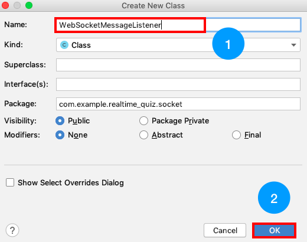

# android-realtime-quiz🥳

## Android 서비스에 연결하기

이번 파트에서는 AWS로 개발한 채팅 서버에 Android를 연결해보도록 하겠습니다.

### 핸즈온 시간을 고려하여 대부분의 기능이 구현되어 있는 Base 프로젝트를 만들어 두었습니다.
### 핸즈온은 이 Base 프로젝트를 수정해 나가는 형식으로 진행됩니다.

#### Base Project에 구현되었거나 변경된 파일들입니다. 필요하실 때 천천히 살펴봐 주세요!

- [app - build.gralde] - ButterKnife, OkHttp등 라이브러리 추가
- [AndroidManifest.xml] - 인터넷 퍼미션 추가, GameActivity 컴포넌트 추가
- [JoinActivity.java, activity_join.xml] - username 입력 Activity 추가

- [GameActivity.java, activity_game.xml] - start 버튼을 클릭하면 게임시작

**[start 버튼 누르기 전]**

**[start 버튼 누른 후]**
- [model package] - DynamoDB와 맞는 Chat, Game 모델 추가
- [view package] - RecyclerView 구현을 위한 class 추가
- [adapter package] - RecyclerView 구현을 위한 ChatAdapter 추가
- [drawable] - AUSG Logo, 오렌지 버튼, 오렌지 Radius Background 추가
- [colors.xml] - 색상 추가
- [strings.xml] - string 추가

### 1. Base Project Clone

cli에 git이 설치되신 분들은

~~~
$git clone https://github.com/yebonkim/android-realtime-quiz.git
$git checkout Base
~~~

를 입력해주세요.

git이 설치되지 않은 분들은 아래 그림과 같이 직접 [Branch:master▼]를 눌러 [Base]로 바꿔주세요.
 

그리고 [Clone or Download▼]를 눌러 [Download Zip] 버튼을 눌러주세요.

---

### 2. Socket Package 추가

안드로이드 코드에 WebSocket을 관리해주기 위한 [WebSocketManager.java]와 [NetDefine.java], [WebSocketMessageListener.java] 파일을 추가해줄 것입니다.

아래와 같이 [com.example.realtime_quiz] 를 클릭한 후 마우스 오른쪽 클릭하여 

[New] - [Package]를 차례로 클릭해줍니다.

아래와 같은 화면이 뜨면 [socket]을 입력하고 [Ok] 버튼을 클릭해주세요.

---

[WebSocketManager.java] 파일부터 추가해보겠습니다.

- WebSocketManager는 WebSocket을 연결하고 해제하는 관리를 하며 특히 메시지가 도착할 경우 Chat 메시지인지 Game 메시지인지에 따라 WebSocketMessageListener에게 메시지를 전달합니다.

아래와 같이 [socket] 을 클릭한 후 마우스 오른쪽 클릭하여 

[New] - [Java class]를 차례로 클릭해줍니다.

아래와 같은 화면이 뜨면 [WebSocketManager]을 입력하고 [Ok] 버튼을 클릭해주세요.

WebSocketManager.java 파일이 열리면 아래 소스를 복사 & 붙여넣기 해 주세요.

~~~
package com.example.realtime_quiz.socket;

import android.util.Log;

import androidx.annotation.Nullable;

import com.example.realtime_quiz.model.Chat;
import com.example.realtime_quiz.model.Game;
import com.example.realtime_quiz.model.WebSocketMessage;

import okhttp3.OkHttpClient;
import okhttp3.Request;
import okhttp3.Response;
import okhttp3.WebSocket;
import okhttp3.WebSocketListener;
import okhttp3.logging.HttpLoggingInterceptor;
import okio.ByteString;

public class WebSocketManager {
    private static final String TAG = WebSocketManager.class.getSimpleName();

    private Game mGame;

    private OkHttpClient mClient;
    private WebSocket mSocket;
    private WebSocketMessageListener mWsMsgListener;

    private static class Singleton {
        private static final WebSocketManager instance = new WebSocketManager();
    }

    private WebSocketManager() {
        HttpLoggingInterceptor logger = new HttpLoggingInterceptor();
        logger.setLevel(HttpLoggingInterceptor.Level.BASIC);
        mClient = new OkHttpClient.Builder()
                .addInterceptor(logger)
                .build();
        Request request = new Request.Builder().url(NetDefine.WSS_ADDRESS).build();

        mSocket = mClient.newWebSocket(request, mWebSocketListener);

        mClient.dispatcher().executorService().shutdown();
    }

    public static WebSocketManager getInstance (WebSocketMessageListener wsMsgListener) {
        Singleton.instance.setWebSocketMessageListener(wsMsgListener);
        return Singleton.instance;
    }

    @Nullable
    public Game getGame() {
        return mGame;
    }

    public void sendMsg(String msg) {
        mSocket.send(msg);
    }

    public void setWebSocketMessageListener(WebSocketMessageListener wsMsgListener) {
        mWsMsgListener = wsMsgListener;
    }

    public void close() {
        mSocket.close(200, "succeed");
        mClient.dispatcher().executorService().shutdown();
    }

    private WebSocketListener mWebSocketListener = new WebSocketListener() {
        WebSocketMessage msg;

        @Override
        public void onOpen(WebSocket webSocket, Response response) {
            super.onOpen(webSocket, response);
            Log.d(TAG, "open");
        }

        @Override
        public void onMessage(WebSocket webSocket, String text) {
            super.onMessage(webSocket, text);
            Log.d(TAG, "msg(str) : " + text);

            if (mWsMsgListener == null) {
                return;
            }

            msg = new Chat().strToObj(text);

            if (msg != null) {
                mWsMsgListener.onChatDataReceived((Chat) msg);
                return;
            }

            msg = new Game().strToObj(text);

            if (msg != null) {
                mGame = (Game) msg;
                mWsMsgListener.onGameDataReceived((Game) msg);
                return;
            }
        }

        @Override
        public void onMessage(WebSocket webSocket, ByteString bytes) {
            super.onMessage(webSocket, bytes);
            Log.d(TAG, "msg(byte) : " + bytes.toString());
        }

        @Override
        public void onClosing(WebSocket webSocket, int code, String reason) {
            super.onClosing(webSocket, code, reason);
            Log.d(TAG, "closing");
        }

        @Override
        public void onClosed(WebSocket webSocket, int code, String reason) {
            super.onClosed(webSocket, code, reason);
            Log.d(TAG, "closed");

            if (mWsMsgListener != null) {
                mWsMsgListener.onSocketClosed(code);
            }
        }

        @Override
        public void onFailure(WebSocket webSocket, Throwable t, Response response) {
            super.onFailure(webSocket, t, response);
            Log.d(TAG, "socket fail : " + t.getMessage());
        }
    };
}

~~~
---
다음으로 [WebSocketMessageListener.java] 파일을 추가하겠습니다.

- WebSocketMessageListener는 각 소켓 사용처에서 Chat 메시지, Game 메시지, Close 신호를 받기위한 리스너입니다.

아래와 같이 [socket] 을 클릭한 후 마우스 오른쪽 클릭하여 

[New] - [Java class]를 차례로 클릭해줍니다.

아래와 같은 화면이 뜨면 [WebSocketMessageListener]를 입력하고 [Ok] 버튼을 클릭해주세요.

WebSocketMessageListener.java 파일이 열리면 아래 소스를 복사 & 붙여넣기 해 주세요.
~~~
package com.example.realtime_quiz.socket;

import com.example.realtime_quiz.model.Chat;
import com.example.realtime_quiz.model.Game;

public interface WebSocketMessageListener {
    void onGameDataReceived(Game game);
    void onChatDataReceived(Chat chat);
    void onSocketClosed(int code);
}

~~~

---

다음으로 [NetDefine.java] 파일을 추가하겠습니다.

- NetDefine에서는 웹소켓 엔드포인트 주소를 설정합니다.

아래와 같이 [socket] 을 클릭한 후 마우스 오른쪽 클릭하여 

[New] - [Java class]를 차례로 클릭해줍니다.

아래와 같은 화면이 뜨면 [NetDefine]을 입력하고 [Ok] 버튼을 클릭해주세요.

NetDefine.java 파일이 열리면 아래 소스를 복사 & 붙여넣기 해 주세요.
~~~
package com.example.realtime_quiz.socket;

public class NetDefine {
    public static final String WSS_ADDRESS = "wss://자신의 websocket endpoint";
}
~~~

### 참고 (WSS Endpoint 보는 방법)
- [Websocket 테스트](https://github.com/yebonkim/android-realtime-quiz/blob/master/guide/AWS_websocket_test_guide.md) 상단을 참고해주세요!

---
### 3. JoinActivity.java 변경
WebSocketManager가 준비되었으니 그에 맞게 JoinActivity를 변경해보겠습니다!

JoinActivity.java에 아래 [주석이름] - [추가할 코드] 적어두었습니다.

JoinActivity.java안에서 해당 [주석이름]이 있는 곳에 [추가할 코드]를 추가해주세요.

**번거로우신 분들은 [링크](https://raw.githubusercontent.com/yebonkim/android-realtime-quiz/master/android/app/src/main/java/com/example/realtime_quiz/activity/JoinActivity.java)에서 모두 복사 & 붙여넣기 해주셔도 됩니다.**

#### Add WebSocket import
~~~
import com.example.realtime_quiz.socket.WebSocketManager;
import com.example.realtime_quiz.socket.WebSocketMessageListener;
~~~

#### add WebSocket define code
~~~
WebSocketManager mWebSocketManager;
~~~

#### add WebSocket initialization code
~~~
mWebSocketManager = WebSocketManager.getInstance(mWsMsgListener);
~~~

#### add WebSocketMessageListener
~~~
WebSocketMessageListener mWsMsgListener = new WebSocketMessageListener() {
        @Override
        public void onGameDataReceived(Game game) {
            goToGameActivity(mUsername);
        }

        @Override
        public void onChatDataReceived(Chat chat) {
            return;
        }

        @Override
        public void onSocketClosed(int code) {
            Toast.makeText(JoinActivity.this, getString(R.string.err_game_disconnected), Toast.LENGTH_LONG).show();
        }
    };
~~~

#### add send start code
~~~
if (mWebSocketManager != null) {
    mWebSocketManager.sendMsg("start!");
}
~~~

### 3. GameActivity.java 변경

GameActivity.java에 아래 [주석이름] - [추가할 코드] 적어두었습니다.

GameActivity.java안에서 해당 [주석이름]이 있는 곳에 [추가할 코드]를 추가해주세요.

**번거로우신 분들은 [링크](https://raw.githubusercontent.com/yebonkim/android-realtime-quiz/master/android/app/src/main/java/com/example/realtime_quiz/activity/GameActivity.java)에서 모두 복사 & 붙여넣기 해주셔도 됩니다.**

---

#### add WebSocket import
~~~
import com.example.realtime_quiz.socket.WebSocketManager;
import com.example.realtime_quiz.socket.WebSocketMessageListener;
~~~

#### add WebSocket define code
~~~
WebSocketManager webSocketManager;
~~~

#### add WebSocket initialization code
~~~
mWebSocketManager = WebSocketManager.getInstance(mWsMsgListener);
~~~

#### add getting game data code
~~~
Game game = mWebSocketManager.getGame();

if (game != null) {
    mWsMsgListener.onGameDataReceived(game);
}
~~~

#### add WebSocketListener Code
~~~
private WebSocketMessageListener mWsMsgListener = new WebSocketMessageListener() {
        @Override
        public void onGameDataReceived(Game game) {
            if (game.getNowConsonant() != null) {
                mConsonant.setText(game.getNowConsonant());
            }
        }

        @Override
        public void onChatDataReceived(Chat chat) {
            mAdapter.addNewChat(chat);
            mChatList.smoothScrollToPosition(mAdapter.getItemCount());
        }

        @Override
        public void onSocketClosed(int code) {
            Toast.makeText(GameActivity.this, getString(R.string.err_game_disconnected), Toast.LENGTH_LONG).show();
            finish();
        }
    };
~~~ 

#### add send code
~~~
mWebSocketManager.sendMsg(newChat.toString());
~~~

#### add onDestroy code
~~~
@Override
protected void onDestroy() {
    super.onDestroy();
    webSocketManager.close();
}
~~~

### Android 서비스에 연결하기를 마지막으로 핸즈온 과정이 모두 완료되었습니다!🎉🎉
지금까지 잘 따라오셨다면 아래와 같이 동작하는 것을 볼 수 있습니다.

### 모두 수고하셨습니다. 앞으로도 재밌는 개발되세요!😀

- [AWS IAM 역할(Role) 만들기](https://github.com/yebonkim/android-realtime-quiz/blob/master/guide/AWS_IAM_guide.md)
- [DynamoDB 생성하기](https://github.com/yebonkim/android-realtime-quiz/blob/master/guide/AWS_DynamoDB_guide.md)
- [Websocket 연결 기능 만들기](https://github.com/yebonkim/android-realtime-quiz/blob/master/guide/AWS_websocket_connection_guide.md)
- [Websocket 테스트](https://github.com/yebonkim/android-realtime-quiz/blob/master/guide/AWS_websocket_test_guide.md)
- [Websocket 게임 및 채팅 기능 만들기](https://github.com/yebonkim/android-realtime-quiz/blob/master/guide/AWS_websocket_guide.md)
- [Android 서비스에 연결하기](https://github.com/yebonkim/android-realtime-quiz/blob/master/guide/Android_guide.md)
- [삭제 가이드](https://github.com/yebonkim/android-realtime-quiz/blob/master/guide/delete_guide.md)
