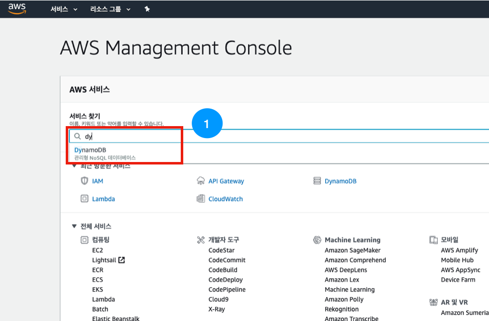
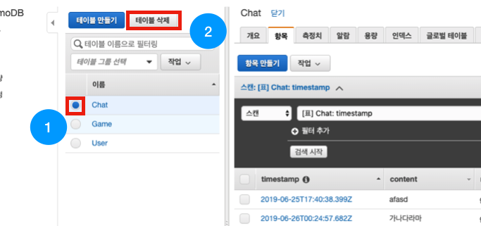
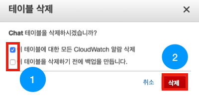
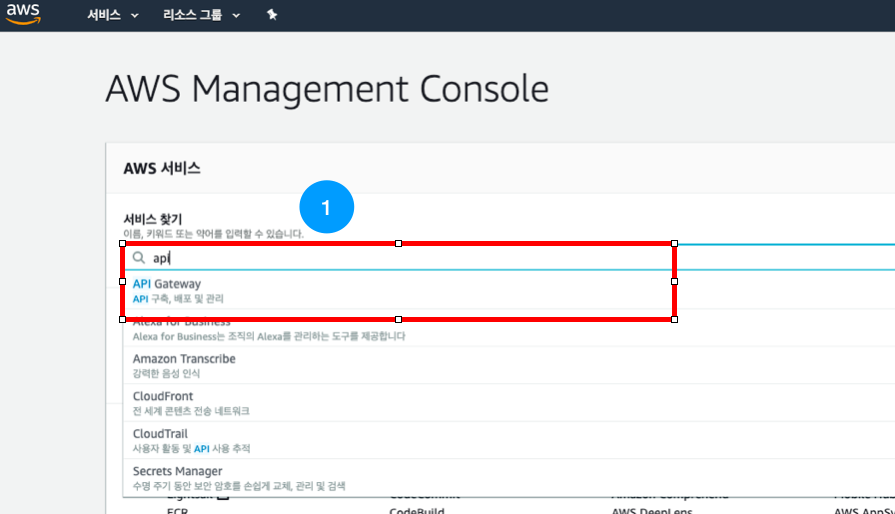
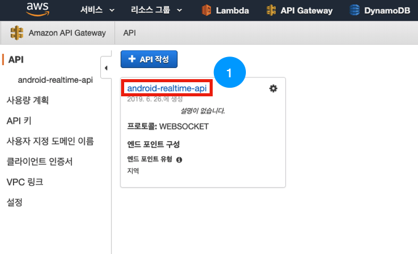
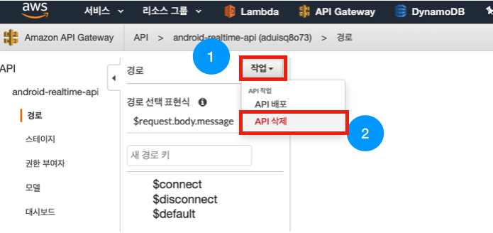
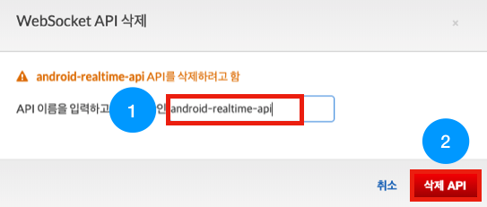
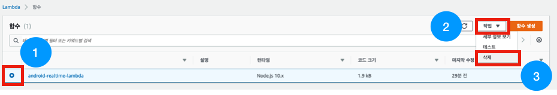
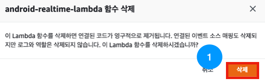

# android-realtime-quiz🥳

## Delete 가이드

혹시 모를 요금 과금 방지를 위해 모든 AWS 서비스를 삭제해봅시다!

### 1. DynamoDB 삭제

아래와 같이 AWS console에 접속하여 'dy'를 검색 후 DynamoDB 서비스로 접속합니다.

아래와 같은 화면이 뜨면 [Chat] 테이블을 선택하고 [테이블 삭제] 버튼을 누릅니다.

아래와 같은 창이 뜨면 [ClodWatch 알람 삭제]는 선택하고 [백업]은 선택 해제하여 [삭제] 버튼을 누릅니다.

남은 [User], [Game] 테이블에 대해서도 똑같이 진행해주세요!

---

### 2. API Gateway 삭제

아래와 같이 AWS console에 접속하여 'API'를 검색 후 API Gateway 서비스로 접속합니다.

아래와 같이 [android-realtime-api]를 선택해주세요.

세부 화면으로 들어와 [작업] 버튼을 눌러 [API 삭제]를 눌러줍니다.

아래와 같은 화면이 뜨면 [android-realtime-api]를 입력후 [삭제 API]버튼을 눌러주세요.

---

### 3. Lambda 삭제

아래와 같이 AWS console에 접속하여 'la'를 검색 후 Lambda 서비스로 접속합니다.

아래 그림과 같이 [android-realtime-lambda]를 선택한 후 [작업]버튼을 눌러 [삭제] 버튼을 눌러줍니다.

아래와 같은 창이 뜨면 [삭제] 버튼을 눌러주세요.

### 모든 삭제 과정이 마무리 되었습니다!

- [AWS IAM 역할(Role) 만들기](https://github.com/yebonkim/android-realtime-quiz/blob/master/guide/AWS_IAM_guide.md)
- [DynamoDB 생성하기](https://github.com/yebonkim/android-realtime-quiz/blob/master/guide/AWS_DynamoDB_guide.md)
- [Websocket 연결 기능 만들기](https://github.com/yebonkim/android-realtime-quiz/blob/master/guide/AWS_websocket_connection_guide.md)
- [Websocket 테스트](https://github.com/yebonkim/android-realtime-quiz/blob/master/guide/AWS_websocket_test_guide.md)
- [Websocket 게임 및 채팅 기능 만들기](https://github.com/yebonkim/android-realtime-quiz/blob/master/guide/AWS_websocket_guide.md)
- [Android 서비스에 연결하기](https://github.com/yebonkim/android-realtime-quiz/blob/master/guide/Android_guide.md)
- [삭제 가이드](https://github.com/yebonkim/android-realtime-quiz/blob/master/guide/delete_guide.md)